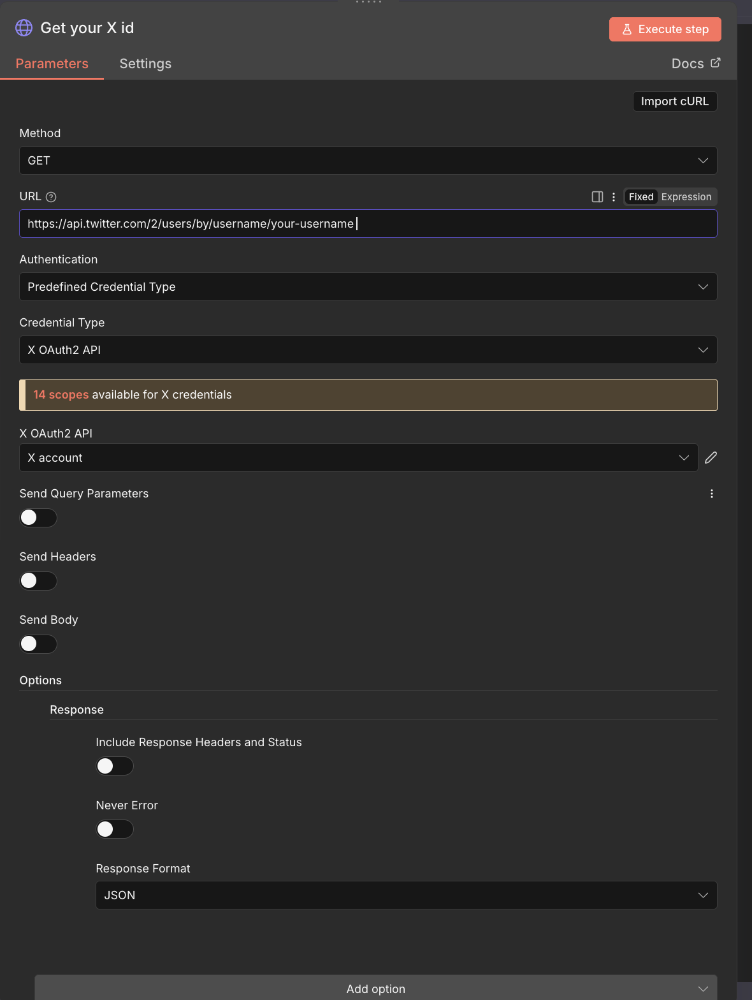

## Workflow Automation

Developer apps for Facebook and X (Twitter) are created, required permissions are set, long-lived access tokens are generated, and connected to n8n nodes.
Content and image URLs are fetched from a sheet, images are converted to binary, and uploaded to X using the media upload API.
Posting is automated by sending the content and uploaded media to Facebook Pages and X via their APIs, while ensuring content length limits and proper authentication.

**All recordings and screenshots are available in the public folder.**

<video controls src="public/Workflow Automation.mov" title="Title"></video>


## Facebook Graph API Setup for n8n

Follow these steps to configure Facebook posting inside n8n:

### 1. Create a Facebook App

Go to **[https://developers.facebook.com/apps/](https://developers.facebook.com/apps/)**
Create a new app → Fill app details → Choose **Business/Consumer** → Finish setup.

### 2. Configure the App

- Enable **Webhooks** (optional).
- Check **Settings → Basic** and **Settings → Advanced**.
- Switch the app to **Live Mode**.

### 3.In Tools

Open **Graph API Explorer**.
Get a **Access Token** and enable these permissions:

```
pages_show_list
page_events
pages_read_engagement
pages_read_user_content
pages_manage_posts
```

### 4. Get Page Access Token

In the search bar, run:

```
 me/accounts
```

Copy the **Access Token** for the page you want to post to.

### 5. Debug & Extend Token

**Use v23**

Open **Access Token Debugger** → paste token → **Extend Access Token**.

### 6. Use in n8n

Add the **Access Token** to the **Facebook Graph API Node** in n8n.

# X (Twitter) Setup for n8n

1. **Read inputs**

   - From sheet: `Content` and `Image URL`.
   - If `Content.length > 270` → reject / skip (not allowed).

2. **Download image (HTTP Request)**

   - Method: `GET` → URL = `Image URL`
   - Response: **File** → Output field: `data`
   - Convert `data` to binary (so n8n has file binary).

3. **Upload media to X**

   - Node: HTTP Request
   - Method: `POST` → `https://upload.twitter.com/1.1/media/upload.json`
   - Auth: **Predefined Credential** (X OAuth API) - use your **consumer key/secret** (`https://developer.x.com/en`).
   - **Consumer key = API Key**
   - **Consumer Secret = API SECRET**
   - Body: multipart/form-data with binary file.
   - Refer this
     

     ## This additional_owners value came from :

     

   - Save response `media_id_string` to use in tweet.

4. **Post Tweet**

   - Node: HTTP Request
   - Method: `POST` → `https://api.twitter.com/2/tweets`
   - Auth: **X OAUTH2 API** (same credential setup)
   - Headers: `Content-Type: application/json`
   - Body (JSON):

     ```json
     {
       "text": "{{ $('Sheet node').item.json.Content }}",
       "media": { "media_ids": ["{{ $json.media_id_string }}"] }
     }
     ```

   - Response: JSON (tweet result).

5. **Developer account / app setup (quick notes)**

   - Create project/app at **developer.twitter.com** (free tier if available).
   - Auth settings: **Read & Write** (and DM if needed).
   - Callback URLs for n8n OAuth:

     - `https://oauth.n8n.cloud/oauth2/callback` and/or `https://oauth.n8n.cloud/oauth1/callback`
     - Your n8n base URL (e.g. `https://trial99.app.n8n.cloud/`)

   - Get **API Key (consumer key)** and **API Secret (consumer secret)** - add to n8n credentials.
